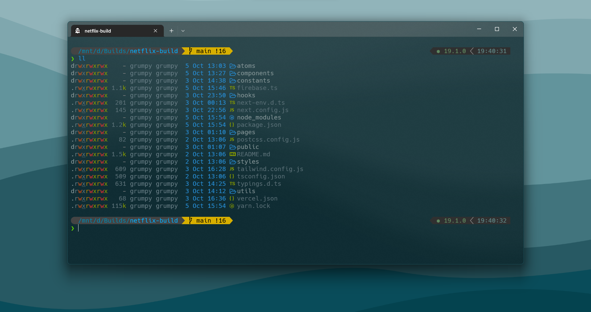
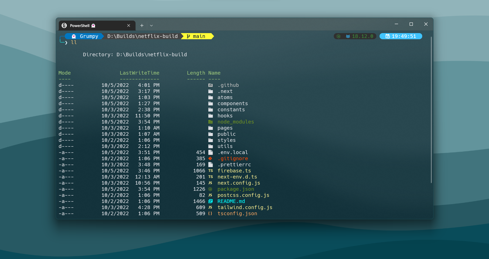

<div>
  <div align="center">
    <h1><code>🐙</code> PunGrumpy's Dotfiles</h1>
  </div>

  <details open>
    <summary>NeoVim</summary>
    
  </details>

  <details>
    <summary>Terminal Linux/OSX</summary>
    
    <p>This terminal use:</p>
    <ul>
        <li>color scheme <strong>Vercel</strong></li>
        <li>fish</li>
        <li>tmux</li>
    </ul>
  </details>

  <details>
    <summary>Terminal Windows</summary>
    
    <p>This terminal use:</p>
    <ul>
        <li>color scheme <strong>Vercel</strong></li>
        <li>powershell</li>
    </ul>
  </details>
</div>

> [!WARNING]
> Don't bindly use my setting unless you know what that entails. Use at your own risk!

> [!TIP]
> For Windows user you can find the color scheme for **Windows Terminal** in <https://windowsterminalthemes.dev/>

## `⚙️` Contents

- NeoVim config
- Git config
- PowerShell config
- Fish config
- Tmux config

## `👽` NeoVim

- [NeoVim](https://neovim.io/) >= 0.9.0 (needs to be built with [**LuaJIT**](https://luajit.org/luajit.html)).
- [LazyVim](https://github.com/LazyVim/LazyVim) - Neovim config for the lazy
- [Telescope](https://github.com/nvim-telescope/telescope.nvim) - Find, Filter, Preview, Pick. All lua, all the time
  - [Ripgrep](https://github.com/BurntSushi/ripgrep) - Recursively searches directories for a regex pattern
  - [FD](https://github.com/sharkdp/fd) - Fast and user-friendly alternative to find
- [vercel.nvim](https://github.com/PunGrumpy/vercel.nvim) - Vercel's Geist colors for Neovim

## `🐚` Shell setup (macOS & Linux)

- [Home Brew](https://brew.sh/)
- [Nerd fonts](https://github.com/ryanoasis/nerd-fonts) - Powerline-patched fonts. I use Hack.
- [Eza](https://eza.rocks/) - `ls` replacement
- [ghq](https://github.com/x-motemen/ghq) - Local Git repository organizer
- [Fish shell](https://fishshell.com/) - User-friendly shell
- [Fisher](https://github.com/jorgebucaran/fisher) - Plugin manager
- [Tide](https://github.com/IlanCosman/tide) - Shell theme. Use version 6 `fisher install ilancosman/tide@v6`
- [z for fish](https://github.com/jethrokuan/z) - Directory jumping `fisher install jethrokuan/z`
- [Fzf for fish](https://github.com/PatrickF1/fzf.fish) - Interactive filtering `fisher install PatrickF1/fzf.fish`
- [Puffer for fish](https://github.com/nickeb96/puffer-fish) - Text expander `fisher install nickeb96/puffer-fish`
- [Pisces for fish](https://github.com/laughedelic/pisces) - Paired symbols `fisher install laughedelic/pisces`

## `👧` PowerShell setup (Windows)

- [Windows Terminal](https://apps.microsoft.com/store/detail/windows-terminal/9N0DX20HK701?hl=th-th&gl=th)
- [Scoop](https://scoop.sh/) - A command-line installer
- [Git for Windows](https://gitforwindows.org/)
- [Oh My Posh](https://ohmyposh.dev/) - Prompt theme engine
- [Terminal Icons](https://github.com/devblackops/Terminal-Icons) - Folder and file icons
- [PSReadLine](https://docs.microsoft.com/en-us/powershell/module/psreadline/) - Cmdlets for customizing the editing environment, used for autocompletion
- [z](https://www.powershellgallery.com/packages/z) - Directory jumper
- [PSFzf](https://github.com/kelleyma49/PSFzf) - Fuzzy finder

## `🦒` Git config

- [Git commitizen](https://github.com/Zhengqbbb/cz-git) - Commitizen helps you commit better messages `bun install -g cz-git`
- [Lazygit](https://github.com/jesseduffield/lazygit/) - Simple terminal UI for git commands `brew install lazygit`
- [Delta](https://github.com/dandavison/delta) - Syntax-highlighting pager for git `brew install git-delta`

## `🤖` AI Config

- [OpenCode](http://opencode.ai/) - AI-powered terminal, code editor, and more
- [Cursor](https://www.cursor.com/) - AI-powered code editor

## `🏗️` Build

```bash
wget -O - https://raw.githubusercontent.com/PunGrumpy/dotfiles/main/build.sh | bash
# or
curl -fsSL https://raw.githubusercontent.com/PunGrumpy/dotfiles/main/build.sh | bash
```

## `🐳` Playground

```bash
docker run -it --rm --name dotfiles-pungrumpy \
  -v $HOME/.config:/home/pungrumpy/.config \
  -v $HOME/.gitconfig:/home/pungrumpy/.gitconfig \
  -v $HOME/.gitignore:/home/pungrumpy/.gitignore \
  -v $HOME/.czrc:/home/pungrumpy/.czrc \
  -v $HOME/.scripts:/home/pungrumpy/.scripts \
  ghcr.io/pungrumpy/dotfiles:latest
```

[More info](https://github.com/PunGrumpy/dotfiles/tree/docker?tab=readme-ov-file) about Docker image

## `©️` Reference setting

<table>
  <tr>
    <td align="center">
      <a href="https://github.com/craftzdog">
        
        <br />
        <sub><b>Takuya Matsuyama</b></sub>
        <br />
        <a href="https://github.com/craftzdog/dotfiles-public">📂</a>
      </a>
    </td>
    <td align="center">
      <a href="https://github.com/mathiasbynens">
      
      <br />
      <sub><b>Mathias Bynens</b></sub>
      <br />
      <a href="https://github.com/mathiasbynens/dotfiles">📂</a>
    </td>
    <td align="center">
      <a href="https://github.com/paulirish">
      
      <br />
      <sub><b>Paul Irish</b></sub>
      <br />
      <a href="https://github.com/paulirish/dotfiles">📂</a>
    </td>
  </tr>
</table>
