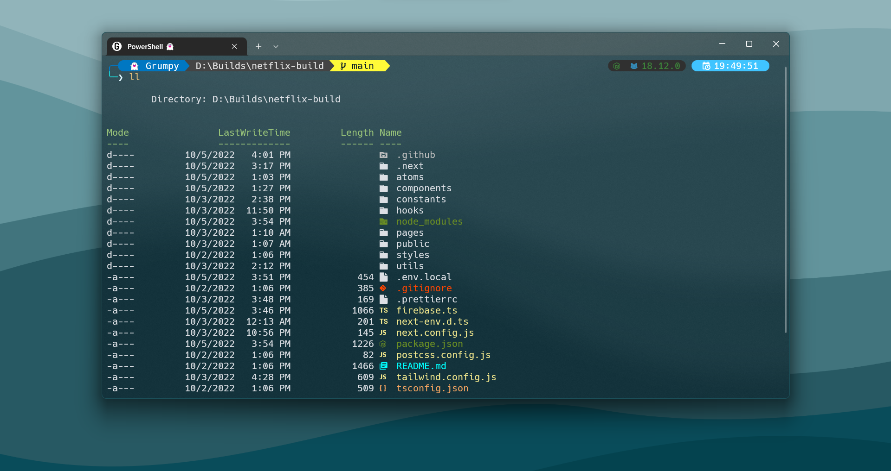

# PunGrumpy's dotfiles

    
Example Terminal 1

    
    
This terminal use:

    <ul>
        <li>color scheme <strong>Solarized Dark (Modded)</strong></li>
        <li>fish</li>
        <li>tmux</li>
    </ul>

    
Example Terminal 2

    
    
This terminal use:

    <ul>
        <li>color scheme <strong>One Half Dark (Modded)</strong></li>
        <li>powershell</li>
    </ul>

    
Example Terminal 3

    
    
This terminal use:

    <ul>
        <li>color scheme <strong>Solarized Dark (Modded)</strong></li>
        <li>zsh</li>
    </ul>

**Warning** : Don't bindly use my setting unless you know what that entails. Use at your own risk!

**Recommend** : For Windows user you can find the color scheme for **Windows Terminal** in https://windowsterminalthemes.dev/

## ⚙️ Contents

- NeoVim config
- git config
- PowerShell config
- Fish config
- Tmux config
- Zsh config

## Neovim setup

Requires [Neovim](https://neovim.io/) (>= 0.8)

- [wbthomason/packer.nvim](https://github.com/wbthomason/packer.nvim) - A plugin manager for Neovim
- [svrana/neosolarized.nvim](https://github.com/svrana/neosolarized.nvim) - A truecolor, solarized dark colorscheme
- [nvim-lualine/lualine.nvim](https://github.com/nvim-lualine/lualine.nvim) - A blazing fast and easy to configure Neovim statusline written in Lua
- [onsails/lspkind-nvim](https://github.com/onsails/lspkind-nvim) - VSCode-like pictograms
- [L3MON4D3/LuaSnip](https://github.com/L3MON4D3/LuaSnip) - Snippet Engine for Neovim written in Lua
- [hrsh7th/cmp-nvim-lsp](https://github.com/hrsh7th/cmp-nvim-lsp) - nvim-cmp source for neovim's built-in LSP
- [hrsh7th/cmp-buffer](https://github.com/hrsh7th/cmp-buffer) - nvim-cmp source for buffer words
- [hrsh7th/nvim-cmp](https://github.com/hrsh7th/nvim-cmp) - A completion engine plugin for neovim written in Lua
- [neovim/nvim-lspconfig](https://github.com/neovim/nvim-lspconfig) - A collection of configurations for Neovim's built-in LSP
- [jose-elias-alvarez/null-ls.nvim](https://github.com/jose-elias-alvarez/null-ls.nvim) - Use Neovim as a language server to inject LSP diagnostics, code actions, and more via Lua.
- [williamboman/mason.nvim](https://github.com/williamboman/mason.nvim) - Portable package manager for Neovim that runs everywhere Neovim runs. Easily install and manage LSP servers, DAP servers, linters, and formatters
- [williamboman/mason-lspconfig.nvim](https://github.com/williamboman/mason-lspconfig.nvim) - Extension to mason.nvim that makes it easier to use lspconfig with mason.nvim
- [glepnir/lspsaga.nvim](https://github.com/glepnir/lspsaga.nvim) - A light-weight lsp plugin based on neovim's built-in lsp with a highly performant UI
- [nvim-treesitter/nvim-treesitter](https://github.com/nvim-treesitter/nvim-treesitter) - [Treesitter](https://github.com/tree-sitter/tree-sitter) configurations and abstraction layer for Neovim
- [kyazdani42/nvim-web-devicons](https://github.com/kyazdani42/nvim-web-devicons) - Lua `fork` of vim-web-devicons for neovim
- [nvim-telescope/telescope.nvim](https://github.com/nvim-telescope/telescope.nvim) - A highly extendable fuzzy finder over lists
- [nvim-telescope/telescope-file-browser.nvim](https://github.com/nvim-telescope/telescope-file-browser.nvim) - File Browser extension for telescope.nvim
- [windwp/nvim-autopairs](https://github.com/windwp/nvim-autopairs) - Autopairs
- [windwp/nvim-ts-autotag](https://github.com/windwp/nvim-ts-autotag) - Use treesitter to auto close and auto rename html tag
- [norcalli/nvim-colorizer.lua](https://github.com/norcalli/nvim-colorizer.lua) - A high-performance color highlighter
- [akinsho/nvim-bufferline.lua](https://github.com/akinsho/nvim-bufferline.lua) - A snazzy bufferline
- [lewis6991/gitsigns.nvim](https://github.com/lewis6991/gitsigns.nvim) - Git integration for buffers
- [dinhhuy258/git.nvim](https://github.com/dinhhuy258/git.nvim) - A simple clone of the plugin vim-fugitive
- [folke/zen-mode.nvim](https://github.com/folke/zen-mode.nvim) - Distraction-free mode
- [iamcco/markdown-preview.nvim](https://github.com/iamcco/markdown-preview.nvim) - Markdown live preview

## Shell setup (macOS & Linux)

- [Home Brew](https://brew.sh/)
- [Nerd fonts](https://github.com/ryanoasis/nerd-fonts) - Powerline-patched fonts. I use Hack.
- [Exa](https://the.exa.website/) - `ls` replacement
- [ghq](https://github.com/x-motemen/ghq) - Local Git repository organizer
- [peco](https://github.com/peco/peco) - Interactive filtering
- [Fish shell](https://fishshell.com/) - User-friendly shell
- [Fisher](https://github.com/jorgebucaran/fisher) - Plugin manager
- [Tide](https://github.com/IlanCosman/tide) - Shell theme. Use version 5: `fisher install ilancosman/tide@v5`
- [z for fish](https://github.com/jethrokuan/z) - Directory jumping: `fisher install jethrokuan/z`

## PowerShell setup (Windows)

- [Windows Terminal](https://apps.microsoft.com/store/detail/windows-terminal/9N0DX20HK701?hl=th-th&gl=th)
- [Scoop](https://scoop.sh/) - A command-line installer
- [Git for Windows](https://gitforwindows.org/)
- [Oh My Posh](https://ohmyposh.dev/) - Prompt theme engine
- [Terminal Icons](https://github.com/devblackops/Terminal-Icons) - Folder and file icons
- [PSReadLine](https://docs.microsoft.com/en-us/powershell/module/psreadline/) - Cmdlets for customizing the editing environment, used for autocompletion
- [z](https://www.powershellgallery.com/packages/z) - Directory jumper
- [PSFzf](https://github.com/kelleyma49/PSFzf) - Fuzzy finder

## Git config

- [Git commitizen](https://github.com/commitizen/cz-cli) - Commitizen helps you commit better messages `npm install -g commitizen` and `npm install -g cz-conventional-changelog`

## ©️ Reference setting

- [Takuya](https://github.com/craftzdog/dotfiles-public)
